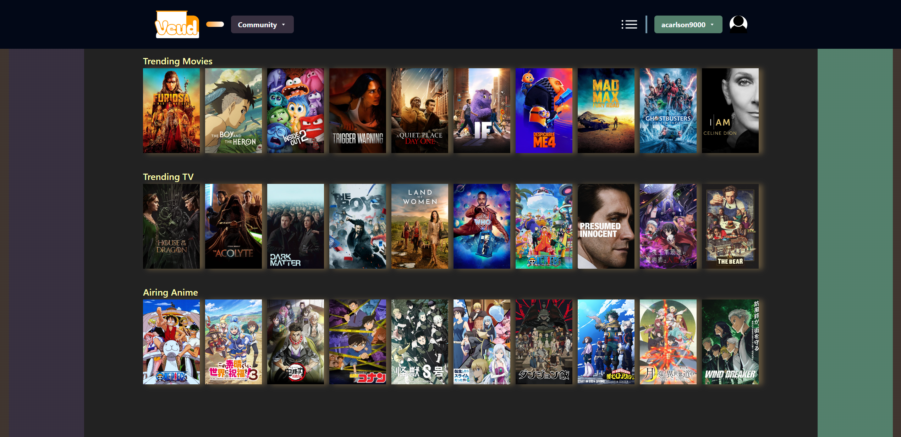
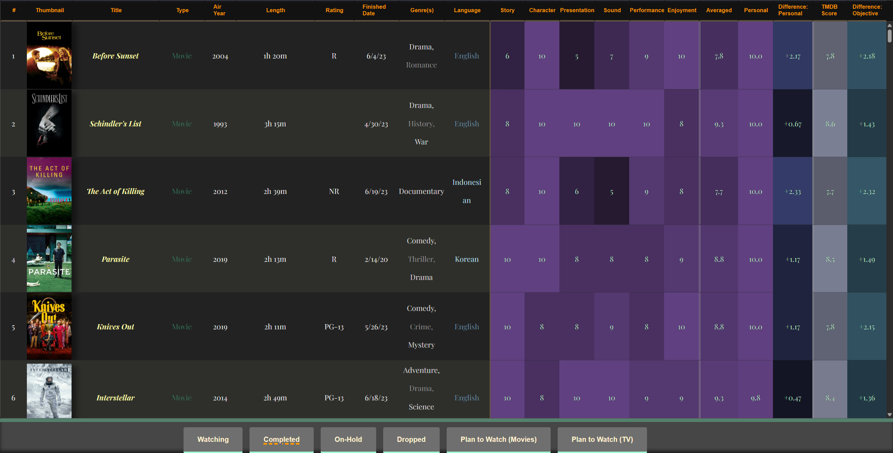

<p align="center">
  <a href="https://www.veud.net/">
    
  </a>
</p>

Veud is a multimedia tracking and rating platform, focused on giving users an intuitive and visually-appealing way of cataloging what they've viewed.

---

<p align="center">
  <a href="https://www.veud.net/">
    
  </a>
</p>

<p align="center">
  <a href="https://www.veud.net/lists/acarlson9000/liveaction/completed">
    
  </a>
</p>

## Built With

* [Remix](https://remix.run/) web framework
* [AG Grid](https://www.ag-grid.com/) datagrid used for watchlists
* [Nivo](https://nivo.rocks/) rich dataviz components built on [D3](https://d3js.org/)
* [The Movie Database (TMDB)](https://www.themoviedb.org/) movie and TV data
* Anime and manga data from [AniList](https://anilist.co/) with links to [MyAnimeList](http://myanimelist.net/)
* [Fly](https://maven.apache.org/) app deployment with [Docker](https://www.docker.com/)
* Multi-region, distributed, production-ready
  [SQLite Database](https://sqlite.org/) with
  [LiteFS](https://fly.io/docs/litefs/).
* Healthcheck endpoint for
  [Fly backups region fallbacks](https://fly.io/docs/reference/configuration/#services-http_checks)
* Two-Factor Authentication (2fa) with support for authenticator apps.
* Transactional email with [Resend](https://resend.com/) and forgot
  password/password reset support.
* Database ORM with [Prisma](https://prisma.io/)
* Caching via [cachified](https://npm.im/@epic-web/cachified): Both in-memory
  and SQLite-based (with
  [better-sqlite3](https://github.com/WiseLibs/better-sqlite3))
* Styling with [SCSS](https://sass-lang.com/) and [Tailwind](https://tailwindcss.com/)
* An excellent, customizable component library with
  [Radix UI](https://www.radix-ui.com/)
* End-to-end testing with [Playwright](https://playwright.dev/)
* Local third party request mocking with [MSW](https://mswjs.io/)
* Unit testing with [Vitest](https://vitest.dev/) and
  [Testing Library](https://testing-library.com/) with pre-configured Test
  Database
* Code formatting with [Prettier](https://prettier.io/)
* Linting with [ESLint](https://eslint.org/)
* Static Types with [TypeScript](https://typescriptlang.org/)
* Runtime schema validation with [zod](https://zod.dev/) 

## Building

### Prerequisites

* [Node.js](https://nodejs.org/)
* [npm](https://www.npmjs.com/)
* [Flyctl](https://fly.io/docs/flyctl/install/)

### Installing

```
npm install
```

## Running

### Development
```
npm run dev
```

### Production
```
npm run start
```

## Testing

### Playwright

End-to-End tests to verify that the application functions properly from a user's perspective. Test users are created and automatically deleted once testing is complete in order to keep the local database clean and tests isolated from one another

```
npm run test:e2e:dev
```

### Vitest

Lower level tests of utilities and individual components

```
npm run test --coverage
```

### Linting

Code linting using ESLint to keep code consistent and readable

```
npm run lint
```

## Authors

* **Aaron Carlson** - [ajccarlson](https://github.com/ajccarlson)

## Acknowledgments

* [The Epic Stack](https://github.com/epicweb-dev/epic-stack) project starter