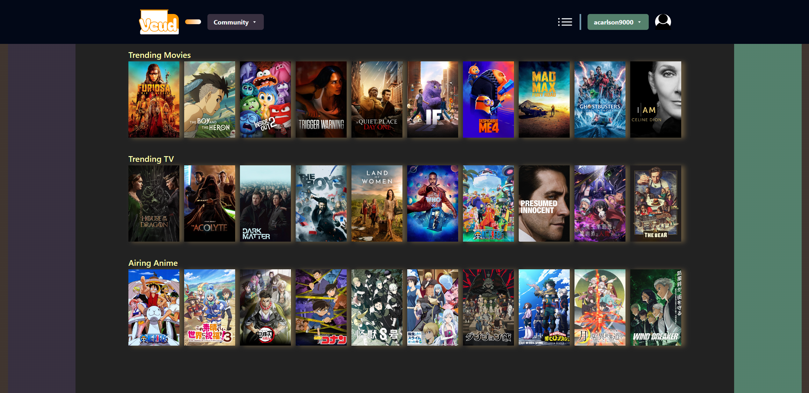
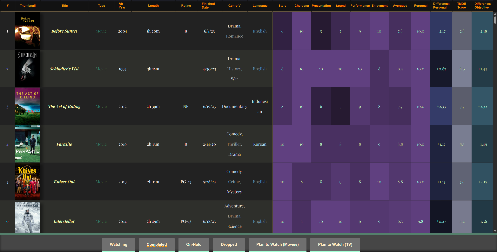

<p align="center">
  <a href="https://www.veud.net/">
    
  </a>
</p>

Veud is a multimedia tracking and rating platform, focused on giving users an intuitive and visually-appealing way of cataloging what they've viewed.

---

<p align="center">
  <a href="https://www.veud.net/">
    
  </a>
</p>

<p align="center">
  <a href="https://www.veud.net/lists/acarlson9000/liveaction/completed">
    
  </a>
</p>

## Built With

* [Remix](https://remix.run/) web framework
* [AG Grid](https://www.ag-grid.com/) datagrid used for watchlists
* [Nivo](https://nivo.rocks/) rich dataviz components built on [D3](https://d3js.org/)
* [The Movie Database (TMDB)](https://www.themoviedb.org/) movie and TV data
* Anime and manga data from [AniList](https://anilist.co/) with links to [MyAnimeList](http://myanimelist.net/)
* Served through a [Cloudflare Tunnel](https://developers.cloudflare.com/cloudflare-one/connections/connect-networks/) and run under [PM2](https://pm2.keymetrics.io/) on a single host
* Local [SQLite](https://sqlite.org/) database with a health-check endpoint at `/resources/healthcheck`
* Two-Factor Authentication (2fa) with support for authenticator apps.
* Transactional email with [Resend](https://resend.com/) and forgot
  password/password reset support.
* Database ORM with [Prisma](https://prisma.io/)
* Caching via [cachified](https://npm.im/@epic-web/cachified): Both in-memory
  and SQLite-based (with
  [better-sqlite3](https://github.com/WiseLibs/better-sqlite3))
* Styling with [SCSS](https://sass-lang.com/) and [Tailwind](https://tailwindcss.com/)
* An excellent, customizable component library with
  [Radix UI](https://www.radix-ui.com/)
* End-to-end testing with [Playwright](https://playwright.dev/)
* Local third party request mocking with [MSW](https://mswjs.io/)
* Unit testing with [Vitest](https://vitest.dev/) and
  [Testing Library](https://testing-library.com/) with pre-configured Test
  Database
* Code formatting with [Prettier](https://prettier.io/)
* Linting with [ESLint](https://eslint.org/)
* Static Types with [TypeScript](https://typescriptlang.org/)
* Runtime schema validation with [zod](https://zod.dev/) 

## Building

### Prerequisites

* [Node.js](https://nodejs.org/)
* [npm](https://www.npmjs.com/)
* [PM2](https://pm2.keymetrics.io/) (`npm i -g pm2`) — process manager for production
* [cloudflared](https://developers.cloudflare.com/cloudflare-one/connections/connect-networks/downloads/) — exposes the local server via a Cloudflare Tunnel

### Installing

```
npm install
```

## Running

### Development
```
npm run dev
```

### Production

Build the app, then run it under PM2 — a single instance in `fork` mode with
`NODE_ENV=production` (multiple workers would contend on the one SQLite file):

```
npm run build
npm run start:prod   # pm2 start ecosystem.config.cjs --env production
pm2 save             # persist the process list
pm2 startup          # print a boot command so PM2 resurrects the app on reboot
```

`npm run start:prod` also starts an hourly SQLite backup process (see **Backups**).

#### Serving via Cloudflare Tunnel

The app listens on `PORT` (default `4021`); `cloudflared` fronts it and terminates TLS. Point
the tunnel at the local origin:

```
cloudflared tunnel --url http://localhost:4021
```

(or a named tunnel with an ingress rule to `http://localhost:4021`). Cloudflare forwards the real
client IP as `CF-Connecting-IP` and the original scheme as `X-Forwarded-Proto: https`; the server
depends on both — the rate limiter keys on `CF-Connecting-IP` and `trust proxy` is set to
`loopback`. Ensure the tunnel doesn't strip those headers, and confirm the site loads without a
redirect loop.

#### Backups

`start:prod` runs `scripts/backup-db.mjs` on start and hourly (a PM2 `cron_restart`), taking
consistent, timestamped SQLite backups via the online-backup API — safe to run while the app is
<<<<<<< HEAD
live — and prunes old ones by retention. With no Fly volume anymore, **also copy the backups
off-machine** (e.g. a scheduled `rsync` or object-storage upload) so a disk failure can't lose
them. To restore: stop the app and copy a backup file back over the live database path.
=======
live — and pruning old ones by retention. Each snapshot is copied to a throwaway restore path and
checked for SQLite integrity, foreign-key violations, required tables, and all repository
migrations before it is retained.

Run a one-off backup or repeat the restore drill against the newest snapshot with:

```
npm run db:backup
npm run db:verify-backup
# or choose a snapshot explicitly:
npm run db:verify-backup -- backups/data-<timestamp>.db
```

Set `BACKUP_VERIFY_USERNAME` to a known production username to also fail verification if the
snapshot came from the wrong/empty database. Set `BACKUP_OFFSITE_DIR` to an existing
network-mounted or independently synced directory to atomically copy every verified snapshot there;
`BACKUP_OFFSITE_KEEP` controls its retention and defaults to `BACKUP_KEEP`. A second directory on
the same disk is not an off-machine backup.

To restore the live database after a successful drill:

```
npm run stop:prod
cp backups/data-<timestamp>.db prisma/data.db
rm -f prisma/data.db-wal prisma/data.db-shm
npm run start:prod
```
>>>>>>> develop

#### Log rotation

PM2 writes `out.log` and `error.log`. Install the log-rotate module so they don't grow unbounded:

```
pm2 install pm2-logrotate
```

## Canonical media identity

Tracking V2 links user-owned entry snapshots to shared provider-backed `Media`
records. Deploy and backfill it in stages:

```
npm run db:backup
npx prisma migrate deploy
npm run media:backfill
npm run media:backfill -- --commit --limit 25
npm run media:backfill -- --commit
npm run tracking:backfill
npm run tracking:backfill -- --commit --limit 25
npm run tracking:backfill -- --commit
```

Both backfills are dry-run by default and idempotent. Run the media identity
backfill first; the tracking-state backfill then normalizes status, score, dates,
repeat evidence, and episode/chapter/volume progress without overwriting Entry
or its history. Neither backfill calls an upstream provider.

## Testing

### Playwright

End-to-End tests to verify that the application functions properly from a user's perspective. Test users are created and automatically deleted once testing is complete in order to keep the local database clean and tests isolated from one another

```
npm run test:e2e:dev
```

### Vitest

Lower level tests of utilities and individual components

```
npm run test --coverage
```

### Linting

Code linting using ESLint to keep code consistent and readable

```
npm run lint
```

## Authors

* **Aaron Carlson** - [ajccarlson](https://github.com/ajccarlson)

## Acknowledgments

* [The Epic Stack](https://github.com/epicweb-dev/epic-stack) project starter
